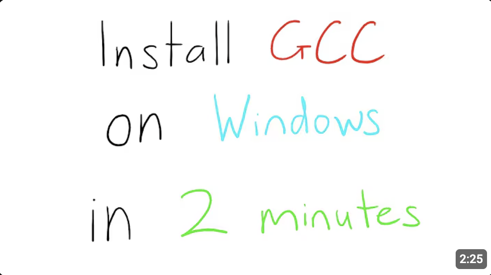

# Hangman Game ☠️

A fun minigame I made in my free time using C++ to create the popular game used for problem-solving and for just passing the time. It features three separate difficulties (Easy, Medium, Hard) and over 2500+ words to keep you playing endlessly. I hope you enjoy and please let me know if there is anything that could be improved on to enhance the experience! 

## Before You Play:

### Make sure you have C++ installed:
- **For Mac Users:** 
You can download the C++ compiler Clang using `xcode-select --install` inside the terminal. Mac also tends to have GCC pre-installed, but if not you can run `sudo apt install g++`.
- **For Windows Users:** To get GCC on Windows, my favorite installation video is from Nick Walton:  
 Make sure you have the proper extensions needed for whatever IDE you are using to play this game. If using VSCode like me, you might need to also get the C/C++ extension. 

### Running the Game:
To run the C++ file `game.cpp`, you can do something like:  
`g++ game.cpp -o new.out`  
Then finally you can play the game by simply running the executable with:  
`./new.out`  
Enjoy!

## This project gave me experience in:
- Building something from scratch
- A beginner form of game-design, constantly asking myself how to achieve maximum convenience for the player, especially if I was just some random user playing this for the first time
- Utilizing ***extraction***, constantly looking to see where I had repetitive parts of my code that could be put into a separate function for reusability and just overall cleaner structure
- Staying consistent and building something from start to finish

